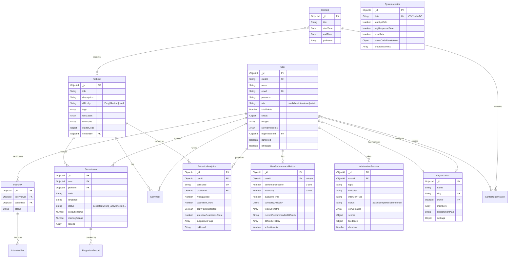
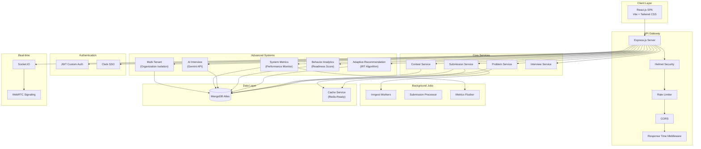
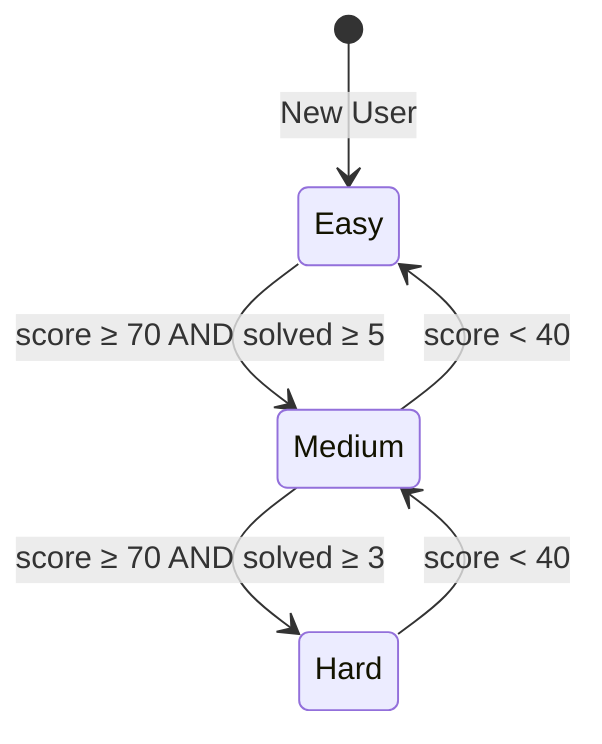
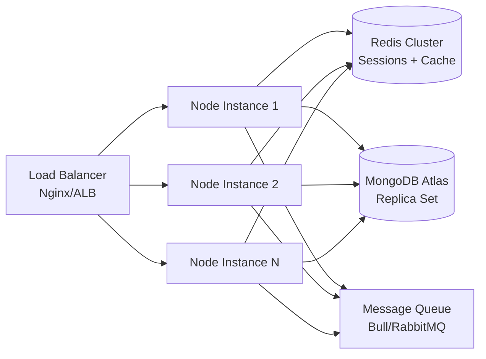

# MERN-Based Remote Technical Interview Platform
## Research Documentation & Architecture

---

## 1. ER Diagram (Entity Relationship)



---

## 2. System Architecture



---

## 3. Adaptive Difficulty Algorithm

### Mathematical Foundation

The recommendation engine implements a simplified **Item Response Theory (IRT)** model:

```
performanceScore = (accuracy × 0.4) + (speedScore × 0.3) + (consistencyScore × 0.3)
```

Where:
- **accuracy** = (correctSubmissions / totalSubmissions) × 100
- **speedScore** = max(0, 100 − (avgSolveTime / expectedTime) × 50)
- **consistencyScore** = min(100, solveVelocity × 33.3)

### Difficulty Progression State Machine



### Weak Topic Detection
- Topics with accuracy < 50% AND attempts ≥ 3 are flagged
- 60% of recommendations target weak topics
- 30% are general at recommended difficulty
- 10% are stretch problems (one level harder)

---

## 4. Security Architecture

| Layer | Technology | Purpose |
|-------|-----------|---------|
| Transport | HTTPS/TLS | Encrypted communication |
| Headers | Helmet.js | XSS, clickjacking, and MIME sniffing protection |
| Auth | JWT + Clerk | Dual authentication (custom + SSO) |
| Password | bcrypt (12 rounds) | Password hashing with salt |
| Rate Limiting | express-rate-limit | DDoS prevention (200 req/15min dev, 100 prod) |
| Input Validation | express-validator | SQL injection and XSS prevention |
| RBAC | Custom middleware | Role-based access (candidate, interviewer, admin) |
| Behavior Monitoring | BehaviorAnalytics | Suspicious activity detection |
| Data Privacy | Soft delete pattern | GDPR-compliant data handling |

### Authentication Flow
```
Client → Bearer Token → Auth Middleware
  ├─ Try JWT verification (custom users)
  │   └─ Decode → Find user by userId → Attach to req
  └─ Try Clerk verification (SSO users)
      └─ Verify token → Find user by clerkId → Attach to req
```

---

## 5. Scalability Strategy

### Horizontal Scaling Plan



### How This System Scales to 1M Users

| Component | Current | At Scale |
|-----------|---------|----------|
| **Cache** | In-memory Map | Redis Cluster (sub-ms reads) |
| **Database** | Single MongoDB | Replica Set + Sharding |
| **Sessions** | JWT (stateless) | Already scalable (no server state) |
| **File Storage** | Local | S3/CloudFront CDN |
| **Background Jobs** | Inngest | Inngest + Bull Queue workers |
| **Search** | MongoDB queries | Elasticsearch (problem search) |
| **Real-time** | Socket.IO single | Socket.IO + Redis adapter |
| **Metrics** | In-memory buffer | Redis pub/sub + InfluxDB |

### Database Indexing Strategy

All models include strategic compound indexes:
- `User`: email, totalPoints (leaderboard), role, isDeleted
- `Submission`: (user, problem), (user, createdAt), (status), (isFlagged)
- `UserPerformanceMetrics`: userId (unique), performanceScore, difficulty
- `BehaviorAnalytics`: (userId, createdAt), sessionId, riskLevel
- `AIInterviewSession`: (userId, status), (topic, difficulty), scores

---

## 6. Interview Readiness Score Algorithm

```
readinessScore = 100 − Σ(penalties)

Penalties:
  - Tab switches:    min(20, tabSwitchCount × 2)
  - Idle ratio:      min(30, (idleTime / totalDuration) × 30)  
  - Copy/paste:      min(20, copyPasteCount × 10)
  - Low keystrokes:  15 (if duration > 60s AND keystrokes < 50)

Risk classification:
  - Low:    0 suspicious flags
  - Medium: 1-2 suspicious flags  
  - High:   3+ suspicious flags
```

---

## 7. Comparison with Existing Platforms

| Feature | LeetCode | HackerRank | **Our Platform** |
|---------|----------|------------|-----------------|
| Adaptive Difficulty | ❌ Manual | ❌ Manual | ✅ IRT-based engine |
| Behavior Analytics | ❌ | ❌ | ✅ Full tracking |
| AI Interviewer | ❌ | ❌ | ✅ Gemini-powered |
| Multi-Tenant | ❌ | ✅ | ✅ Organization-scoped |
| Readiness Score | ❌ | ❌ | ✅ Behavioral scoring |
| System Monitoring | Internal | Internal | ✅ Built-in metrics |
| Video Interviews | ❌ | ✅ | ✅ WebRTC + Socket.IO |
| Open Source | ❌ | ❌ | ✅ MERN stack |

---

## 8. Research Contributions

1. **Adaptive Problem Recommendation**: Applied simplified IRT model to coding problem recommendation, demonstrating feasibility of personalized learning paths in interview preparation platforms.

2. **Behavioral Biometrics for Interview Integrity**: Implemented keystroke dynamics and interaction pattern analysis as lightweight proctoring indicators, contributing to remote assessment security research.

3. **Conversational AI for Technical Assessment**: Designed a provider-agnostic AI interview system with dynamic question generation, follow-up depth tracking, and multi-dimensional scoring.

4. **Multi-Tenant Architecture for EdTech**: Demonstrated shared-schema multi-tenancy pattern suitable for institution-level deployment with subscription-based feature gating.

---

## 9. Future Scope

- **Machine Learning Integration**: Train custom models on user performance data for better recommendations
- **Video Proctoring**: Computer vision-based attention detection during contests
- **Collaborative Coding**: Real-time pair programming with interviewer
- **Natural Language Processing**: Auto-grading of behavioral interview responses
- **Mobile Application**: React Native cross-platform app
- **Blockchain Certificates**: Verifiable skill certificates on blockchain
- **Advanced Analytics Dashboard**: Predictive analytics for hiring decisions

---

## 10. API Reference

### New Endpoints Added

| Method | Endpoint | Auth | Description |
|--------|----------|------|-------------|
| GET | `/api/recommendations` | ✅ | Personalized problem recommendations |
| GET | `/api/recommendations/stats` | ✅ | Performance metrics |
| POST | `/api/recommendations/recalculate` | ✅ | Recalculate user metrics |
| POST | `/api/behavior/track` | ✅ | Track behavior event |
| GET | `/api/behavior/readiness` | ✅ | Interview readiness score |
| GET | `/api/behavior/user/:userId` | Admin | User behavior summary |
| GET | `/api/metrics/system` | Admin | System health |
| GET | `/api/metrics/performance` | Admin | API performance stats |
| GET | `/api/metrics/endpoints` | Admin | Per-endpoint breakdown |
| POST | `/api/organizations` | ✅ | Create organization |
| GET | `/api/organizations` | ✅ | List organizations |
| GET | `/api/organizations/:id` | ✅ | Get organization |
| POST | `/api/organizations/:id/members` | Org Admin | Add member |
| DELETE | `/api/organizations/:id/members/:userId` | Org Admin | Remove member |
| GET | `/api/organizations/:id/leaderboard` | ✅ | Org leaderboard |
| GET | `/api/organizations/:id/analytics` | ✅ | Org analytics |
| POST | `/api/ai-interview/start` | ✅ | Start AI interview |
| POST | `/api/ai-interview/:id/message` | ✅ | Send response |
| POST | `/api/ai-interview/:id/end` | ✅ | End + get scores |
| GET | `/api/ai-interview/history` | ✅ | Past sessions |
| GET | `/api/ai-interview/:id` | ✅ | Session detail |
